### Nama : Albhani Fadillah Haryady
### NIM : 312410130
### kelas : TI 24 A 1

# Praktikum 7

## 1. Menjalankan Web Server
Untuk menjalankan web server dari menu XAMPP Control
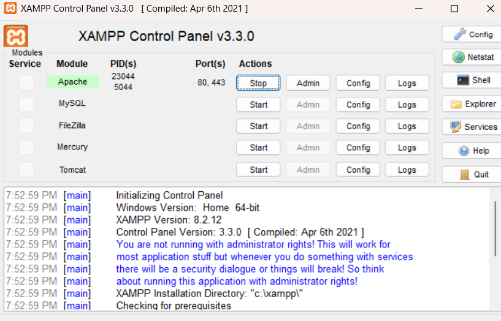

## 2. Memulai PHP
Buat folder lab7_php_dasar pada root directory web server (d:\xampp\htdocs)
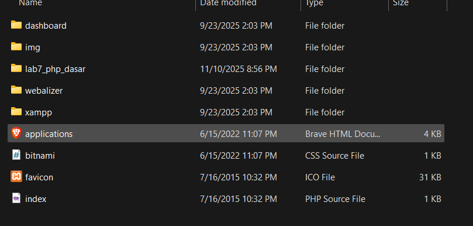
Kemudian untuk mengakses direktory tersebut pada web server dengan mengakses URL:
http://localhost/lab7_php_dasar/
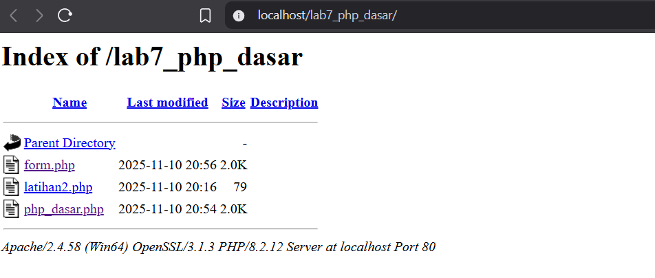

## 3. PHP Dasar
Buat file baru dengan nama php_dasar.php pada directory tersebut. Kemudian buat
kode seperti berikut.
```php
<!DOCTYPE html>
<html lang="en">
<head>
  <meta charset="UTF-8">
  <meta name="viewport" content="width=device-width, initial-scale=1.0">
  <title>PHP Dasar</title>
</head>
<body>
  <h1>Belajar PHP Dasar</h1>

  <?php
    echo "Hello Dunia";
  ?>
</body>
</html>
```
Kemudian untuk mengakses hasilnya melalui URL:
http://localhost/lab7_php_dasar/php_dasar.php
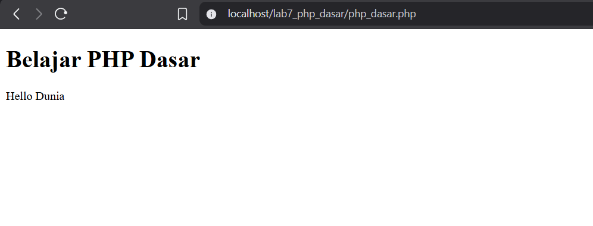

## 4. Variable PHP
Menambahkan variable pada program.
```php
<?php
  $nim  = "312410130";
  $nama = "Albhani Fadillah";

  echo "NIM  : " . $nim . "<br>";
  echo "Nama : " . $nama;
?>
```
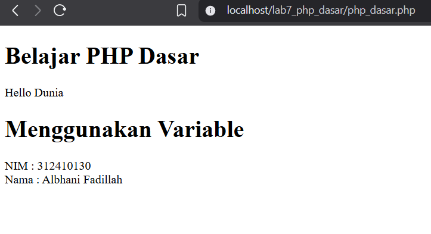

## 5. Predefine Variable $_GET
```php
<h1>Predefine Variable</h1>
<?php
echo 'Selamat Datang ' . $_GET['nama'];
?>
```
Untuk mengaksesnya gunakan URL:
http://localhost/lab7_php_dasar/latihan2.php?nama=Albhani
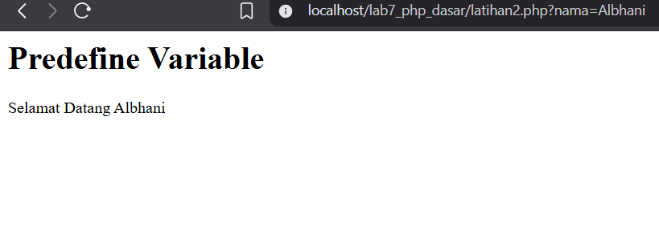

## 6. Membuat Form Input
```php
<!DOCTYPE html>
<html lang="en">
<head>
  <meta charset="UTF-8">
  <meta name="viewport" content="width=device-width, initial-scale=1.0">
  <title>PHP Dasar</title>
</head>
<body>
  <h2>Form Input</h2>

  <form method="post">
    <label>Nama:</label>
    <input type="text" name="nama" required>
    <input type="submit" value="Kirim">
  </form>

  <?php
    if ($_SERVER["REQUEST_METHOD"] === "POST") {
      $nama = htmlspecialchars($_POST["nama"]);
      echo "<h3>Selamat Datang, " . $nama . "!</h3>";
    }
  ?>
</body>
</html>
```
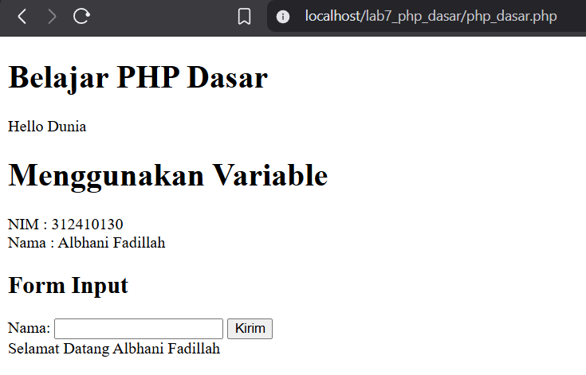

## 7. Operator
```php
<h1>Operator</h1>
<?php
  $gaji  = 1000000;
  $pajak = 0.1;
  $thp   = $gaji - ($gaji * $pajak);

  echo "Gaji sebelum pajak = Rp. $gaji <br>";
  echo "Gaji yang dibawa pulang = Rp. $thp";
?>
```
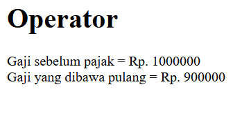

## 8. Kondisi IF
```php
<h1>Kondisi IF</h1>
<?php
  $nama_hari = date("l");

  if ($nama_hari == "Sunday") {
    echo "Minggu";
  } elseif ($nama_hari == "Monday") {
    echo "Senin";
  } else {
    echo "Selasa";
  }
?>
```
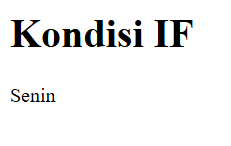

## 9. Kondisi Switch
```php
<h1>Kondisi Switch</h1>
<?php
  $nama_hari = date("l");

  switch ($nama_hari) {
    case "Sunday":
      echo "Minggu";
      break;
    case "Monday":
      echo "Senin";
      break;
    case "Tuesday":
      echo "Selasa";
      break;
    default:
      echo "Sabtu";
      break;
  }
?>
```
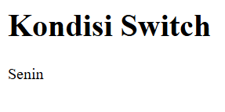

## 10. Perulangan for
```php
<h1>Perulangan for</h1>
<?php
  echo "Perulangan 1 sampai 10 <br />";

  for ($i = 1; $i <= 10; $i++) {
    echo "Perulangan ke: " . $i . "<br />";
  }

  echo "Perulangan Menurun dari 10 ke 1 <br />";

  for ($i = 10; $i >= 1; $i--) {
    echo "Perulangan ke: " . $i . "<br />";
  }
?>
```
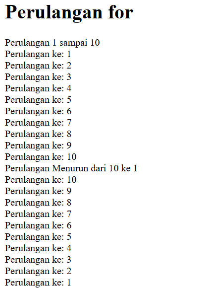

## 11. Perulangan while
```php
<h1>Perulangan while</h1>
<?php
  echo "Perulangan 1 sampai 10 <br />";

  $i = 1;
  while ($i <= 10) {
    echo "Perulangan ke: " . $i . "<br />";
    $i++;
  }
?>
```
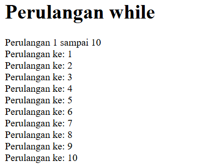

## 12. Perulangan dowhile
```php
<h1>Perulangan dowhile</h1>
<?php
  echo "Perulangan 1 sampai 10 <br />";

  $i = 1;
  do {
    echo "Perulangan ke: " . $i . "<br />";
    $i++;
  } while ($i <= 10);
?>
```
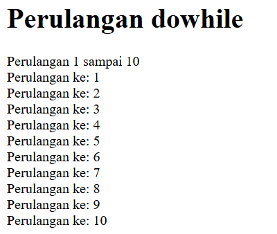

# Pertanyaan dan Tugas
Buatlah program PHP sederhana dengan menggunakan form input yang menampilkan
nama, tanggal lahir dan pekerjaan. Kemudian tampilkan outputnya dengan menghitung
umur berdasarkan inputan tanggal lahir. Dan pilihan pekerjaan dengan gaji yang
berbeda-beda sesuai pilihan pekerjaan.
```php
<!DOCTYPE html>
<html lang="en">
<head>
  <meta charset="UTF-8">
  <meta name="viewport" content="width=device-width, initial-scale=1.0">
  <title>Form Data Diri</title>
</head>
<body>
  <h2>Form Input Data Diri</h2>

  <form method="post">
    <label>Nama:</label><br>
    <input type="text" name="nama" required><br><br>

    <label>Tanggal Lahir:</label><br>
    <input type="date" name="tanggal_lahir" required><br><br>

    <label>Pekerjaan:</label><br>
    <select name="pekerjaan" required>
      <option value="">-- Pilih Pekerjaan --</option>
      <option value="Programmer">Programmer</option>
      <option value="Desainer">Desainer</option>
      <option value="Guru">Guru</option>
      <option value="Dokter">Dokter</option>
      <option value="Petani">Petani</option>
    </select><br><br>

    <input type="submit" value="Kirim">
  </form>

  <hr>

  <?php
    if ($_SERVER["REQUEST_METHOD"] == "POST") {
      $nama           = htmlspecialchars($_POST["nama"]);
      $tanggal_lahir  = $_POST["tanggal_lahir"];
      $pekerjaan      = $_POST["pekerjaan"];

      // Hitung umur
      $tanggal_lahir_obj = new DateTime($tanggal_lahir);
      $sekarang = new DateTime();
      $umur = $sekarang->diff($tanggal_lahir_obj)->y;

      // Tentukan gaji berdasarkan pekerjaan
      switch ($pekerjaan) {
        case "Programmer":
          $gaji = 10000000;
          break;
        case "Desainer":
          $gaji = 8000000;
          break;
        case "Guru":
          $gaji = 6000000;
          break;
        case "Dokter":
          $gaji = 12000000;
          break;
        case "Petani":
          $gaji = 5000000;
          break;
        default:
          $gaji = 0;
      }

      // Tampilkan hasil
      echo "<h3>Hasil Input:</h3>";
      echo "Nama: $nama <br>";
      echo "Tanggal Lahir: $tanggal_lahir <br>";
      echo "Umur: $umur tahun <br>";
      echo "Pekerjaan: $pekerjaan <br>";
      echo "Gaji: Rp " . number_format($gaji, 0, ',', '.');
    }
  ?>
</body>
</html>

```
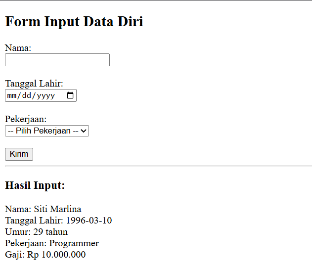